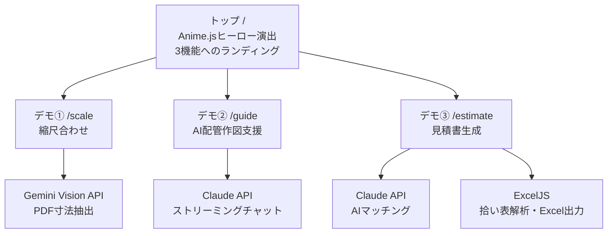
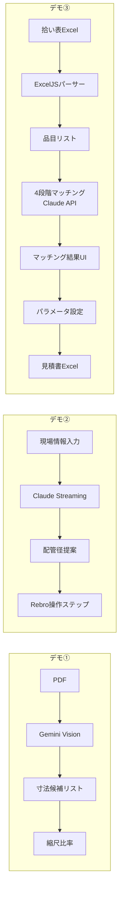
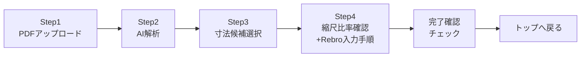
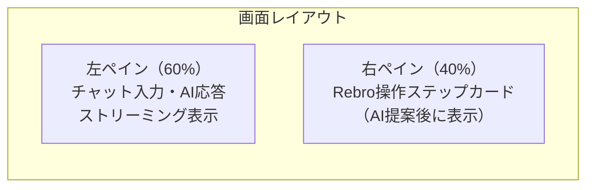
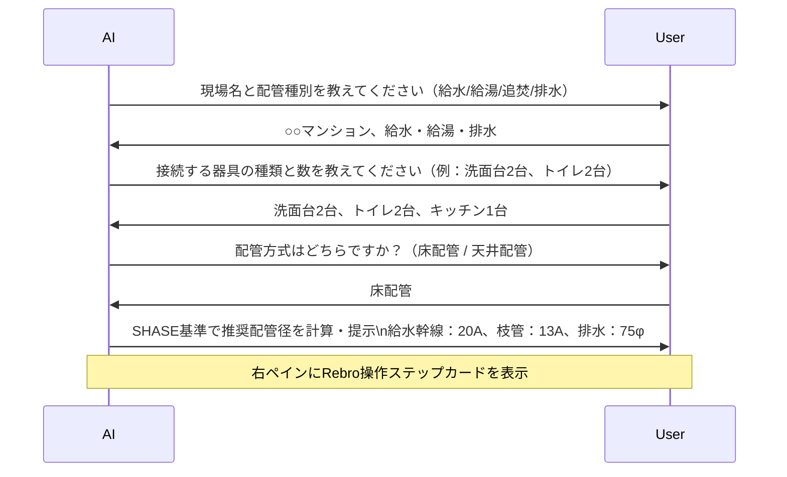
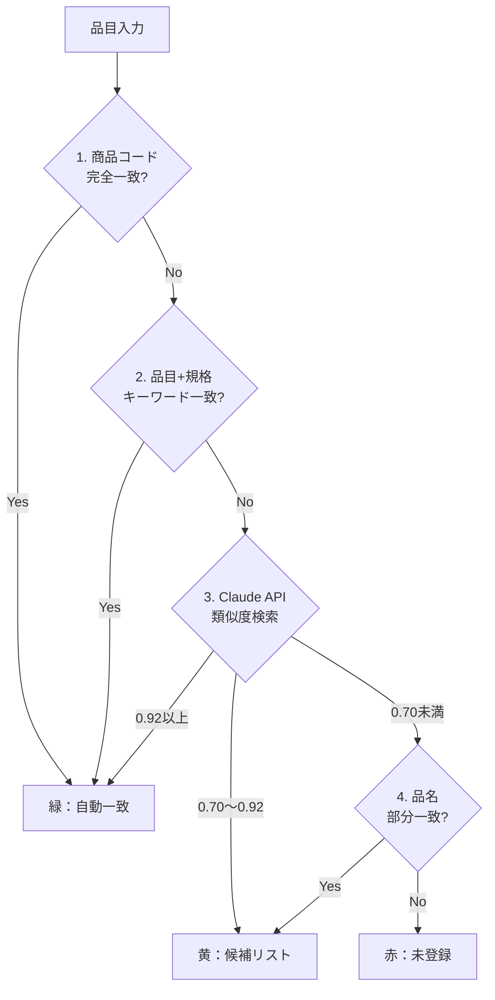

# Rebro AI デモ 設計書 v2

作成日：2026-03-09

---

## 概要

### プロジェクト目標

クライアント（佐藤建設）へのプレゼン用デモWebアプリ。配管設備工事における以下3つの業務をAIで効率化することを実証する。

### AIが解決する課題の全体像

| デモ | 現状の課題 | AIによる解決 |
|---|---|---|
| ① 縮尺合わせ | 図面の寸法を目視で読み取りRebroに手入力 | Gemini VisionがPDFから寸法を自動抽出、縮尺比率を自動計算 |
| ② 配管作図支援 | 配管径の判断に熟練が必要、Rebro操作手順を都度確認 | Claude APIがSHASE基準で配管径を計算し、Rebro操作手順をステップ出力 |
| ③ 見積書生成 | 拾い表から単価を1品目ずつカタログ検索・手入力（数時間） | ClaudeがExcelを解析し4段階マッチングで自動単価付け、見積書Excel自動生成 |

---

## アーキテクチャ

### 技術スタック

| 技術 | 用途 |
|---|---|
| Next.js 16 App Router | フレームワーク |
| Gemini Vision API | デモ①：PDF寸法抽出 |
| Claude API（ストリーミング） | デモ②：チャット型配管支援 |
| Claude API | デモ③：AI単価マッチング |
| ExcelJS | デモ③：拾い表解析・見積書Excel生成 |
| anime.js v4 | トップページアニメーション |
| Radix UI Themes v3 | UIコンポーネント |

### ルート構成



### データフロー



---

## デモ① /scale（縮尺合わせ）

### 課題と解決

**現状の課題：**
Rebroに図面PDFを取り込む際、図面の縮尺とRebro内部の縮尺が合っていないと全寸法がズレる。正しい縮尺比率を求めるには図面の寸法数値を目視で読み取り、Rebroで同じ箇所を実測して割り算する必要がある。

**AIの解決：**
PDFをアップロードするだけでGemini VisionがPDF内の寸法数値を自動抽出。ユーザーは候補から参照寸法を選ぶだけで縮尺比率が自動計算される。

**Rebroとの接点（AIが算出した値をRebroに入力）：**
1. Rebroで「背景図の管理」ダイアログを開く
2. AIが算出した縮尺比率（例：1.034）を「スケール係数」に入力
3. 以降の配管配置が正確な寸法で作業可能になる

### 画面フロー（既存Step1〜4を流用・強化）



### 変更点（既存からの差分）

- ルート変更：`/demo` → `/scale`
- Step4末尾に「Rebroで確認できましたか？」チェックボックスを追加
- チェックを入れると「完了・トップへ」ボタンが活性化
- Step4にRebro操作手順（テキスト）を追加表示

---

## デモ② /guide（AI配管作図支援）

### 課題と解決

**現状の課題：**
配管径の選定にはSHASE（空気調和・衛生工学会）規格の知識が必要で、器具の種類・数・配管方式によって適切な径が変わる。熟練者でないと判断が難しく、Rebroの操作手順も複雑でその都度確認しながら進める必要がある。

**AIの解決：**
チャットで現場情報を伝えるとClaudeがSHASE基準で推奨配管径を計算して提示。さらにRebro上での具体的な操作手順をステップカード形式で自動生成する。新人でも迷わず作業できるようになる。

### 画面レイアウト



### AIの会話フロー



### Rebro操作ステップカード（AI生成例）

```
Step 1: 配管メニュー → 給水管配置 を選択
Step 2: 管径を「20A」に設定
Step 3: メーターボックスから分岐点まで幹線を引く
Step 4: 管径を「13A」に切り替え
Step 5: 各器具（洗面台・トイレ・キッチン）まで枝管を接続
Step 6: 排水管配置 → 管径「75φ」で排水経路を引く
```

各ステップに「完了」ボタンを配置 → クリックで次のステップへ進む

---

## デモ③ /estimate（見積書生成）

### 課題と解決

**現状の課題：**
Rebroが出力する「拾い表Excel」には品名・規格・数量が並んでいるが、見積書にするには1品目ずつカタログを参照して単価を調べ手作業で入力する必要がある。品目数が多く（数百件）、誤マッチングも多発する。

**AIの解決：**
拾い表ExcelをアップロードするとClaudeが品名＋径の組み合わせで4段階マッチングを実行。結果を緑/黄/赤で色分けして確認UIを提供。確認後に見積書Excelを自動生成する。

| 作業 | 現在 | AI後 |
|---|---|---|
| 単価調査 | 1品目ずつカタログ検索（数時間） | 自動マッチング（数秒）+ 人間は差分確認のみ |
| 見積書作成 | 手作業でExcelに転記 | 自動生成 |
| 誤マッチング検出 | 気づかずミスが発生 | 色分けで一目で確認可能 |

### ウィザードフロー


### 各ステップの詳細

**Step1：プロジェクト登録**
- 現場名（テキスト）
- 工事日付（日付ピッカー）
- デベロッパー名（テキスト）

**Step2：拾い表Excelアップロード**
- 複数ファイル対応（水湯焚ファイル + 排水ファイルなど）
- サンプルデータ読み込みボタンを用意（A現場・B現場）
- アップロード後にプレビュー表示（品目数・ファイル名）

**Step3：AIマッチング確認**
- 色分けの凡例：緑=一致・黄=候補あり・赤=未登録
- 緑：自動確定（確認不要）
- 黄：ドロップダウンで候補から選択して確定
- 赤：手動入力 → 「カタログに追加」ボタンでサンプルカタログJSONに追記
- 「全て確定」ボタンで次へ

**Step4：見積もりパラメータ設定**
- 掛率（%）
- 加工費（円）
- 経費率（%）
- 値引き（%）

**Step5：プレビュー確認・Excel出力**
- 見積書プレビュー（画面上で確認）
- 出力シート構成：表紙 / 室別サマリー / 全室集計 / 品目明細 / 識別シート
- 未登録品=赤セル・候補品=黄セルで色分け
- 「Excelダウンロード」ボタン

### Excelパーサーの設計

**階層構造の解析：**
拾い表Excelは空白セルで親カテゴリを表現する階層構造。

```
列B: 「配管」（空白セルが続く間は親カテゴリを保持）
  └ 列C: 「給水」
        └ 列V: 「QXPEM2-13AB-200M」  列W: 14  列X: m
```

処理：行をループしながら空白セルを遡って親カテゴリ名を補完する。

**単位の自動変換：**
- 水湯焚・給水給湯ファイル：配管長さの単位が **m（メートル）**
- 排水ファイル：配管長さの単位が **mm（ミリメートル）**
- ファイル名またはヘッダーから自動判定してmに統一

**マッチングキー：**
品名のみではなく **品名＋径（サイズ）の組み合わせ** でマッチング。

### 4段階マッチングアルゴリズム



### カタログデータ

`public/sample/catalog.json` にサンプル単価データを配置。

```json
{
  "items": [
    {
      "code": "QXPEM2-13AB-200M",
      "name": "架橋ポリエチレン管",
      "spec": "13A",
      "unit": "m",
      "unitPrice": 480
    }
  ]
}
```

### サンプルデータ

`public/sample/` に実データを同梱：
- `A現場_水湯焚.xlsx`
- `A現場_排水.xlsx`
- `B現場_給水給湯.xlsx`
- `B現場_排水.xlsx`

---

## トップページ /

### 構成

- anime.jsによるヒーローアニメーション（既存HeroGrid流用）
- 3つのデモへのカードリンク
- 各カードに「課題→AIの解決」を一言で記載

---

## ファイル構成（変更後）

```
webapp/
├── app/
│   ├── page.tsx                    # トップ（新規作成）
│   ├── scale/
│   │   └── page.tsx                # デモ①（/demo → /scale に移動）
│   ├── guide/
│   │   └── page.tsx                # デモ②（新規作成）
│   ├── estimate/
│   │   └── page.tsx                # デモ③（新規作成）
│   └── api/
│       ├── analyze-pdf/route.ts    # 既存（Gemini Vision）
│       ├── guide-chat/route.ts     # 新規（Claude Streaming）
│       └── estimate-match/route.ts # 新規（Claude マッチング）
├── components/
│   ├── HeroGrid.tsx                # 既存流用
│   ├── Step1Upload.tsx             # 既存流用（/scale用）
│   ├── Step2Analyze.tsx            # 既存流用
│   ├── Step3Select.tsx             # 既存流用
│   ├── Step4Result.tsx             # 既存（確認チェック追加）
│   ├── GuideChat.tsx               # 新規
│   ├── GuideStepCard.tsx           # 新規
│   ├── EstimateWizard.tsx          # 新規
│   └── MatchingTable.tsx           # 新規
├── lib/
│   ├── gemini.ts                   # 既存流用
│   ├── claude-client.ts            # 既存流用
│   ├── excel-parser.ts             # 新規（拾い表解析）
│   ├── matching-engine.ts          # 新規（4段階マッチング）
│   └── excel-generator.ts          # 新規（見積書Excel生成）
└── public/
    └── sample/
        ├── catalog.json            # 新規（サンプルカタログ）
        ├── A現場_水湯焚.xlsx       # 実データコピー
        ├── A現場_排水.xlsx
        ├── B現場_給水給湯.xlsx
        └── B現場_排水.xlsx
```

---

## 追加パッケージ

```bash
npm install exceljs
```

既存パッケージで対応可能なため、追加は ExcelJS のみ。
