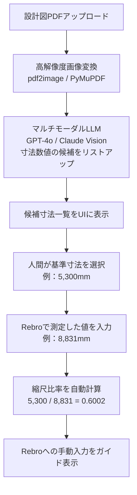
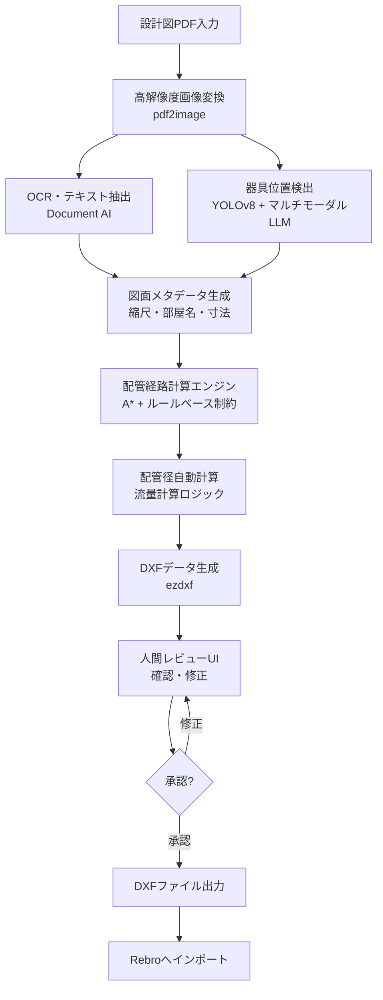
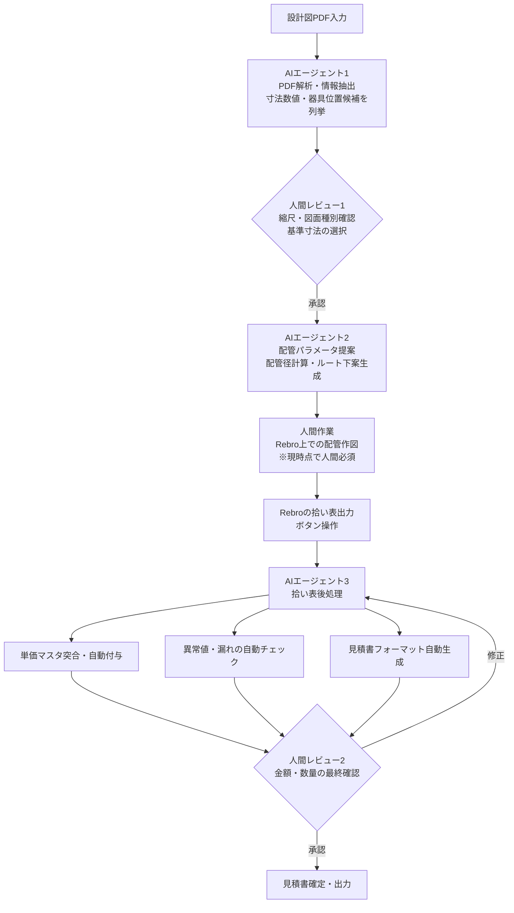
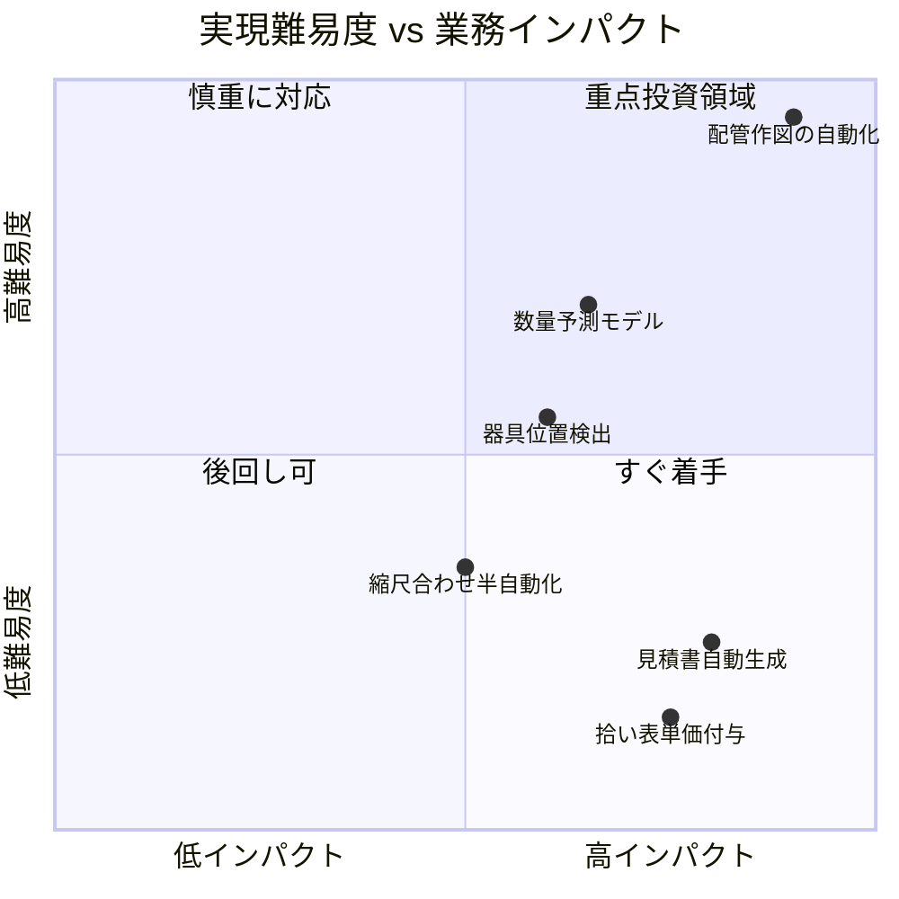

# Rebro 見積り拾い AI検証 作業内容

## 概要

建築設備CADソフト「Rebro（レブロ）」を使った**見積り拾い作業のAI検証**プロジェクト。
A現場・B現場の2現場について、配管図面（給水・給湯・排水）の作図から見積り集計までの一連の作業を検証する。

---

## フォルダ構成

```
③ 見積り拾い AI検証 提出用/
├── A現場/                              # A現場の成果物
│   ├── A現場 設計図.pdf                # 元となる建築設計図
│   ├── A現場 rebro平面図(水湯 床配管).pdf    # Rebroで作図した平面図（給水・給湯）
│   ├── A現場 rebro平面図(排水).pdf     # Rebroで作図した平面図（排水）
│   ├── A現場 rebroアイソメ図(水湯 床配管).pdf # 3D的な配管系統図（給水・給湯）
│   ├── A現場 rebroアイソメ図(排水).pdf # 3D的な配管系統図（排水）
│   ├── 拾い集計まとめ（水湯焚）- 260113.xlsx  # 材料集計表（給水・給湯・追焚）
│   └── 拾い集計まとめ（排水）- 260113.xlsx   # 材料集計表（排水）
│
├── B現場/                              # B現場の成果物
│   ├── B現場.pdf                       # 元となる建築設計図
│   ├── B現場 給水給湯.pdf              # Rebroで作図した平面図（給水・給湯）
│   ├── B現場 排水.pdf                  # Rebroで作図した平面図（排水）
│   ├── B現場 rebroアイソメ図(水湯 天井配管).pdf # 3D的な配管系統図（給水・給湯）
│   ├── B現場 rebroアイソメ図(排水 転がし配管).pdf # 3D的な配管系統図（排水）
│   ├── 拾い集計（B現場 給水給湯）- 260217.xlsx  # 材料集計表（給水・給湯）
│   └── 拾い集計（B現場 排水）- 260217(2).xlsx  # 材料集計表（排水）
│
├── 作業動画/                           # 作業手順を収めた動画
│   ├── ① 縮尺合わせ.mp4               # 手順1：図面の縮尺補正
│   ├── ② 見積り拾い 作図動画 水湯焚.mp4 # 手順2：給水・給湯・追焚の配管作図
│   └── ② 見積り拾い 作図動画 排水.mp4  # 手順2：排水配管の作図
│
├── 作業内容解説/                       # （空フォルダ：解説資料格納予定）
└── 見積り手順.pdf                      # 見積り拾い作業の手順書
```

---

## 作業ステップ

### ステップ1：縮尺合わせ（スケール合わせ）

PDFや画像として読み込んだ建築図面は、Rebro上でのサイズが実寸と一致していない。
そのため、配管作図の前に**図面上の寸法とCAD上の寸法を一致させる補正作業**が必要。

**手順**

1. 読み込んだ図面を拡大し、基準となる寸法（例：5,300mm）を確認する
2. Rebroの計測機能で、その区間の現状の長さを測る（例：8,831mm と表示される）
3. 「縮尺合わせ」機能で、測定値（8,831mm）が基準値（5,300mm）になるよう図面全体を補正する
4. 再計測して基準値と一致していることを確認する

---

### ステップ2：配管の作図

設計図の上に、用途別に色分けして配管を描いていく。

| 配管種別 | 色 | 内容 |
|---|---|---|
| 給湯 | 赤 | お湯の配管 |
| 給水 | 水色 | 水の配管 |
| 追焚 | ピンク/紫 | 浴室追焚用 |
| 排水 | オレンジ | 排水パイプ |

**Rebroの主な機能**

- 線を描くだけでなく、「直径〇ミリの○○管」というデータを保持
- 配管が曲がる部分には継手（エルボなど）が自動配置
- 同じ間取りの部屋は、1部屋分を作図後に他の部屋へコピー&ペーストで一括展開

---

### ステップ3：見積り拾い（材料集計）

配管作図完了後、Rebroの集計機能（拾い表出力）で材料リストを自動生成する。

**出力内容の例**

- 各配管種別ごとのパイプ総延長（メートル）
- 継手の種類別・サイズ別の個数
- その他付属部品の数量

これにより、従来は手作業で定規計測・部品カウントしていた**「拾い作業」がボタン1つで完了**する。

---

## 現場別の概要

| 項目 | A現場 | B現場 |
|---|---|---|
| 配管種別 | 水湯焚（床配管）・排水 | 給水給湯（天井配管）・排水（転がし配管） |
| 集計日 | 2026年1月13日 | 2026年2月17日 |
| 成果物 | 平面図・アイソメ図・集計xlsx | 平面図・アイソメ図・集計xlsx |

---

## AI検証の目的

本プロジェクトは、Rebroを用いた見積り拾い作業において**AIがどの程度支援・自動化できるか**を検証するもの。
作業動画・設計図・集計結果を提出資料として提供し、AIによる処理精度や活用可能性を確認する。

---

## AI技術調査レポート

### 前提：Rebro外部API非公開について

RebroはNYKシステムズ製の建築設備専用CADであり、**外部APIおよびオートメーションSDKは2025年時点で公開されていない**。
これが全ステップにわたるAI自動化の最大の制約条件となる。
Rebroへのデータ連携は、DXF/DWGインポートまたは拾い表Excel出力を経由する迂回ルートが現実的な接点となる。

---

### ステップ1：縮尺合わせ — AI技術調査

#### AIでできること・できないこと

| サブタスク | 実現可能性 | 理由 |
|---|---|---|
| 寸法数値のOCR読み取り（横書き） | 高 | 既存SaaSで95%以上の精度。実用域に達している |
| 縮尺比率の計算 | 高 | 算術処理のみ。AI不要 |
| 縦書き・回転テキストのOCR | 中 | 追加前処理（OpenCVで画像回転）で対応可能 |
| 寸法線と数値の自動対応付け | 中 | 合成データで87.6 mAPだが実図面では36.4 mAPに低下する事例あり。大量アノテーションデータが必要 |
| 基準寸法の自動選択 | 低 | どの寸法を基準にするかはドメイン知識・文脈判断が必要。AI単独では困難 |
| Rebroへの縮尺補正の自動適用 | 不可 | Rebro外部APIが非公開のため直接操作不可 |

#### SaaSで対応できる箇所

| サービス | 対応範囲 | 限界 |
|---|---|---|
| Azure Document Intelligence | テキスト抽出・レイヤー座標取得。カスタムモデルで精度向上可 | 寸法線との意味的対応付けは不可。縦書き認識が弱い |
| Google Document AI | OCR・レイアウト解析。テキスト座標情報の取得 | 建築図面専用プロセッサなし。寸法線構造の理解不可 |
| AWS Textract | フォーム・テーブル抽出 | 日本語対応が限定的。縦書き非対応 |
| GPT-4o / Claude Vision | 画像から直接数値を読み取る指示が可能。候補寸法の列挙に有効 | ハルシネーションリスクあり。高精度が必要な用途への単独使用は不十分 |

#### 開発が必要な箇所

- 縦書き・回転テキスト用のOCR前処理モジュール（OpenCVで画像回転 → OCR）
- 寸法線の矢印・補助線・数値の三点セット検出モデル（YOLOv8のファインチューニング）
- 「基準寸法を候補として提示し人間が選択する」UIの実装
- 縮尺比率の計算ロジック（算術処理のみで容易）
- Rebro操作ガイドの表示（比率を手動入力するよう案内。将来的にRPAで自動化も検討可）

#### 難易度・実現可能性

| 観点 | 評価 |
|---|---|
| 難易度 | 中（寸法線対応付けのみ高） |
| 実現可能性 | 高（半自動化として） |
| 推奨アプローチ | 半自動化：AIが寸法候補を列挙 → 人間が基準寸法を選択 → 縮尺比率をAIが自動計算 |

#### 実装構成



**技術スタック**：PyMuPDF・pdf2image（PDF変換）/ Azure Document Intelligence または GPT-4o Vision API（OCR）/ OpenCV（縦書き対応前処理）/ Next.js（候補表示UI）

---

### ステップ2：配管の作図 — AI技術調査

#### AIでできること・できないこと

| サブタスク | 実現可能性 | 理由 |
|---|---|---|
| 設計図から水回り設備の位置を検出 | 中〜高 | マルチモーダルLLM+YOLOv8ファインチューニングで対応可。ただし座標精度はピクセル誤差あり |
| 配管径の自動計算 | 中 | SHASE基準等の計算式は確立済み。器具数・種別の入力抽出がボトルネック |
| 同一間取りの複製ロジック | 低（容易） | 座標変換の算術処理のみで実装可能 |
| 配管ルート自動生成 | 低〜中 | 法規制・他設備干渉・勾配制約のルール実装工数が膨大。完全自動化は困難 |
| Rebroへの直接操作 | 不可 | 外部API非公開。DXFインポートを経由する迂回ルートが現実的 |

**最大のボトルネック：配管ルート自動生成**
- 排水管は1/100〜1/50の勾配が必要
- 建築基準法施行令・自治体ごとの法規制解釈が必要
- 電気・空調・ガスとの干渉チェックには3Dモデルが必要（2D図面PDFからは原理的に不完全）
- AIの確率的出力が許容されない領域のため、熟練者レビューが必須

#### SaaSで対応できる箇所

| サービス | 対応内容 | 限界 |
|---|---|---|
| GPT-4o / Claude Vision / Gemini 1.5 Pro | 器具位置の概略認識、設備種別の読み取り | 座標精度が低い（ピクセル単位の精密位置特定は不得意） |
| Roboflow | YOLOベースのカスタム物体検出モデル。建築記号のアノテーションで器具位置検出に使用可 | アノテーションデータの整備が前提 |
| Google Document AI / Azure Form Recognizer | 管種・径のテキスト抽出（例：「VLP-20A」） | 図面の配管線自体の解析は不可 |
| Autodesk Forge / APS | BIM/CADデータのAPI処理 | PDFスキャン図面への適用は別途前処理が必要 |

#### 開発が必要な箇所

- 建築設備図面専用の前処理パイプライン（PDF解像度正規化・座標系変換）
- 器具位置の精密座標抽出モジュール（LLM概略認識 → OpenCV画像処理で補正）
- 配管ルーティングエンジン（A* アルゴリズム + 勾配制約・ルールベース）
- 配管径計算エンジン（給水・給湯・排水それぞれの計算ロジック）
- DXF形式での配管データ出力（ezdxf ライブラリ）
- 同一間取り複製ロジック（座標オフセット計算）
- 人間レビューUI（AI出力を図面上にオーバーレイ表示・修正できるインターフェース）

#### 難易度・実現可能性

| 観点 | 評価 |
|---|---|
| 難易度 | 高（ステップ全体で最難関） |
| 実現可能性 | 中（ヒューマン・イン・ザ・ループ型なら実現可能） |
| 推奨アプローチ | AI完全自動化ではなく「AIが配管下案を生成 → 熟練者が確認・修正」。作業時間50〜70%削減が目標 |

#### 実装構成



**技術スタック**：pdf2image・PyMuPDF（PDF変換）/ YOLOv8 + Roboflow（器具検出）/ LangChain + Claude / GPT-4o（図面解析エージェント）/ NetworkX（配管ルーティング）/ ezdxf（DXF出力）/ Next.js + Canvas API（レビューUI）

---

### ステップ3：見積り拾い（材料集計）— AI技術調査

#### AIでできること・できないこと

| サブタスク | 実現可能性 | 理由 |
|---|---|---|
| 拾い表Excelへの単価自動付与 | 高 | 単価マスタとのFuzzy matchingや埋め込みベクトル検索で実用域に達している |
| 異常値・ゼロ数量の自動フラグ | 高 | ルールベース + LLMで対応可能 |
| 見積書フォーマットへの自動転記 | 高 | openpyxl等でExcel→Excel変換は容易 |
| PDF図面テキスト（凡例・注記）からの情報抽出 | 中 | テキストレイヤーが存在するPDFはpdfplumber等で抽出可能。Vision LLMも有効 |
| 過去データを学習した数量予測モデル | 中 | 過去50件以上のデータが整備されていることが前提。精度は±15〜30%の概算レベル |
| 図面画像からパイプ延長の自動計測 | 低 | Vision LLMは「何が配管か」は答えられるが「何メートルか」の定量計測は原理的に苦手 |
| Rebro独自ファイルの直接解析 | 不可 | .rebファイルの仕様は非公開 |

#### SaaSで対応できる箇所

**Excel処理・集計の自動化**

| ツール | 用途 | 備考 |
|---|---|---|
| Microsoft Power Automate | Excel→Excel転記・集計の自動化 | M365環境があればノーコードで実装可能 |
| n8n / Make | Excel/CSV処理の自動化ワークフロー | セルフホスト可能。API連携が容易 |

**建設・設備業向け既製品との比較**

| サービス | 特徴 | 評価 |
|---|---|---|
| 建て役者（ダイテック） | 設備工事積算専用。Rebroとの連携実績あり | 最も近い既製品だがカスタマイズ制約あり。年間費用30〜100万円程度 |
| ANDPAD | 施工管理 + 簡易見積機能 | 拾い集計機能は別途必要 |
| freee工事業 | 中小向け施工管理・原価管理 | 拾い集計機能なし |

#### 開発が必要な箇所

- 拾い表ExcelとCSV単価マスタのFuzzy matching・ベクトル検索による品番突合モジュール
- 数量ゼロ・前回比乖離チェックのレポート自動生成
- 見積書テンプレートExcelへの自動転記スクリプト
- 過去案件データの構造化・ベクトルDB格納（類似案件検索）
- チャットUI（「この案件の材料数量は？」と質問できるインターフェース）

#### 難易度・実現可能性

| 観点 | 評価 |
|---|---|
| 難易度 | 低〜中（拾い表後処理は最も取り組みやすい） |
| 実現可能性 | 高 |
| 推奨アプローチ | Rebroが出力した拾い表ExcelのAI後処理から着手。最短2〜4週間で効果を出せる |

---

### 全体アーキテクチャ（AIエージェント化）

#### ステップ別AI担当 / 人間レビュー設計



#### Human-in-the-loop 設計原則

**自動化すべき箇所（繰り返し・ルールベース）**
- 拾い表の単価マスタ突合
- 数量チェック（前回案件との比較・ゼロ値フラグ）
- Excelフォーマット変換・見積書転記

**人間が必ずレビューすべき箇所**
- 縮尺・図面種別の確認（誤認識が後工程全体に影響）
- 配管作図そのもの（現時点で自動化不可）
- 見積書の金額確定（法的・契約的責任があるため）

**自動エスカレーション条件（例）**
- AIの信頼スコアが閾値（90%）を下回った場合 → 人間に確認依頼
- 前回同種案件との数量乖離が±20%以上 → 要確認フラグ
- 単価マスタ未登録の新規品番が存在 → 人間が単価入力

---

### 段階的導入ロードマップ

#### フェーズ1（0〜3ヶ月）：すぐできる・開発コスト小

**目標：Rebroが出力した拾い表ExcelのAI後処理を自動化**

- 単価マスタとのFuzzy matchingで単価を自動付与
- 数量ゼロ・前回比乖離のチェックレポート自動生成
- 見積書テンプレートExcelへの自動転記
- 技術スタック：Python + openpyxl + rapidfuzz + pandas
- 期待効果：拾い表後処理の工数を50〜70%削減
- 開発コスト：エンジニア1名 × 2〜4週間

#### フェーズ2（3〜9ヶ月）：開発必要・LLM活用

**目標：PDF図面からの情報抽出とLLMによる見積支援チャット**

- PDFテキスト抽出で図面注記・凡例を解析（Azure Document Intelligence）
- Vision LLMで設備種別・仕様の読み取り補助
- 寸法候補の列挙UIと半自動縮尺合わせ
- 過去案件データをベクトルDB（pgvector）に格納し、類似案件検索・材料リスト提案
- 技術スタック：Python / Next.js / Azure Document Intelligence / Claude API or OpenAI API / pgvector
- 期待効果：図面確認・仕様把握の工数削減、見積精度向上
- 開発コスト：エンジニア1〜2名 × 3〜6ヶ月

#### フェーズ3（9ヶ月以降）：高難易度・研究開発要素あり

**目標：配管作図の半自動化と数量予測モデルの構築**

- 器具位置検出モデルのファインチューニング（YOLOv8 + Roboflow）
- 配管ルーティングエンジンの実装（A* + 法規制ルールベース）
- DXF出力 → Rebroインポートパイプラインの構築（ezdxf）
- 過去案件データを用いた数量予測モデル（LightGBM / ファインチューニング）
- Rebroベンダーとの連携協議（IFC/COBie形式での出力対応の検討）
- 技術スタック：YOLOv8 / NetworkX / ezdxf / scikit-learn / LightGBM / IfcOpenShell
- 期待効果：概算見積の自動化（精度±20%）、配管作図支援
- 開発コスト：エンジニア1〜2名 × 6〜12ヶ月 + データ整備期間
- 前提条件：過去案件データ50件以上の構造化整備が必須

---

### ステップ別まとめ



| ステップ | 自動化難易度 | 実現可能性 | 推奨着手順 |
|---|---|---|---|
| ステップ3後処理（単価付与・転記） | 低 | 高 | 最優先（フェーズ1） |
| ステップ1（縮尺合わせ半自動化） | 中 | 高 | フェーズ2前半 |
| ステップ2（配管径計算・器具検出） | 中〜高 | 中 | フェーズ2後半〜フェーズ3 |
| ステップ2（配管ルート自動生成） | 高 | 低〜中 | フェーズ3以降 |
| ステップ2（Rebro直接操作） | 不可（API非公開） | 不可 | ベンダー協議が前提 |
